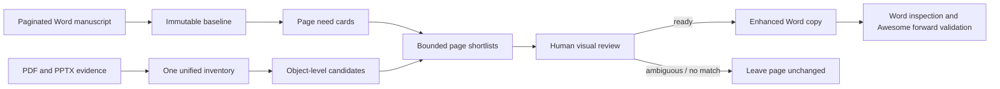

# Enrich PPT Word Materials

[](https://github.com/czd176224-rgb/enrich-ppt-word-materials/actions/workflows/ci.yml)
[](https://github.com/czd176224-rgb/enrich-ppt-word-materials/releases/latest)
[](LICENSE)
[](#requirements)

**Give each PPT page the right source material—without rewriting the manuscript or trusting a similarity score blindly.**

为已经分页的 Word PPT 文稿，从 PDF/PPTX 资料中提取真实图片、图表、表格、流程图和机构 Logo，生成一个可审查的逐页候选素材池，再安全地交给 [Awesome Editable PPT Workflow](https://github.com/czd176224-rgb/awesome-editable-ppt-workflow)。

[Download the latest release](https://github.com/czd176224-rgb/enrich-ppt-word-materials/releases/latest) · [Read the skill contract](SKILL.md) · [Report an issue](https://github.com/czd176224-rgb/enrich-ppt-word-materials/issues)

## The problem it solves

A Word manuscript may already contain the correct slide order and wording, while the useful evidence is scattered across reports, proposals, PDFs, and old decks. Manually finding and copying the right object for every page is slow. Fully automatic matching is faster—but it can quietly insert a national chart where local proof is required, reuse an unrelated meeting photo, mistake a stamp for a logo, or bury the Director under sixteen weak images.

This skill takes the conservative middle path:

- the Word manuscript remains the authority for slide text and order;
- source files are evidence, never instructions;
- retrieval creates a bounded page-local candidate pool;
- every selected asset must be visually opened and accepted;
- weak or ambiguous matches result in no insertion;
- the source Word file is never overwritten.

## What you get

- A material-enhanced copy of the original `.docx`.
- Independent Word image relationships ordered for the page Director.
- A validation receipt with source/output hashes and structural fingerprints.
- A concise page-by-page report of inserted and intentionally unchanged pages.
- Optional forward validation against Awesome Editable PPT Workflow 1.0.1.

## How it works



The pipeline never inserts complete PDF pages or complete PPT slides. Those renders are context-only. Deliverable candidates must be independent source objects or faithful crops.

## Why it is safer than “top score wins”

| Risk | Guardrail |
|---|---|
| Similar keywords but wrong evidence | Scores are recall aids only; they never authorize insertion. |
| Full-page screenshots | Context pages are marked non-deliverable; full-page-like crops are rejected again during assembly. |
| Stamp or QR mistaken for a logo | Forbidden-object and identity calibration gates run before matching. |
| One photo repeated everywhere | Content visuals are page-local by default. |
| Too many candidates | Adaptive pools are capped at 16, with smaller role-specific limits. |
| Original manuscript changes | Visible text, logical-page signatures, table hashes, and comment hashes are compared before delivery. |
| Draft data bypasses review | Assembly accepts only `ready` decisions with an opened, accepted, page-specific visual review for every asset. |
| Accidental overwrite | Source and output paths must differ. |

## Best use cases

- Consulting, investment, policy, research, and project proposal decks.
- A Word manuscript already divided by labels such as `第 1 页 · STORY LINE`.
- Real evidence spread across multiple `.pdf` and `.pptx` files.
- Teams that need traceable, editable source materials instead of generated illustrations.
- Awesome Editable PPT Workflow users who want stronger page-level material control.

Do not use this skill when you want AI-generated illustrations, automatic rewriting, or a generic “decorate every slide” pass.

## Requirements

- Windows 10/11.
- Python 3.11 or newer.
- Microsoft Word for physical pagination and final rendering.
- Microsoft PowerPoint for faithful PPTX slide/object rendering.
- A `.docx` manuscript with consecutive logical page labels using the `PaginationLabel` paragraph style.
- One or more source `.pdf` or `.pptx` files.

## Install as a Codex skill

```powershell
$skillsDir = if ($env:CODEX_HOME) {
    Join-Path $env:CODEX_HOME "skills"
} else {
    Join-Path $env:USERPROFILE ".codex\skills"
}

git clone https://github.com/czd176224-rgb/enrich-ppt-word-materials.git `
    (Join-Path $skillsDir "enrich-ppt-word-materials")

python -m pip install -e (Join-Path $skillsDir "enrich-ppt-word-materials")
```

Restart Codex, then invoke:

```text
$enrich-ppt-word-materials
```

Example request:

```text
Use $enrich-ppt-word-materials to enrich this 24-page Word PPT manuscript
from the attached PDF/PPTX source set. Preserve all manuscript text and page
order, visually review every selected asset, and do not generate slides.
```

## Workflow at a glance

Each command supports `--help`; use a separate working directory for generated JSON, contact sheets, renders, and receipts.

1. `scripts/capture_baseline.py` — verify logical labels and record the immutable manuscript baseline.
2. `scripts/build_inventory.py` — scan the complete source set once and separate context pages from deliverable objects.
3. `scripts/build_shortlists.py --top-k 16` — create bounded page-local retrieval results.
4. `scripts/build_visual_review_packets.py` — render page contact sheets for human review.
5. `scripts/build_candidate_pools.py` — create an ordered draft pool; never assemble this draft directly.
6. Create final page decisions and run `scripts/validate_decisions.py --require-visual-review`.
7. `scripts/assemble_word_materials.py` — create a new review copy and validation receipt.
8. `scripts/render_docx_with_word.py` — inspect every printable page.
9. Optionally run `scripts/validate_awesome_forward.py` against a disposable Awesome project.

The complete behavioral contract, page states, identity rules, and inspection checklist live in [SKILL.md](SKILL.md).

## Final decision format

Only `ready` pages may contain candidates:

```json
{
  "page": 7,
  "decision": "ready",
  "candidate_asset_ids": ["pdf-0021-image-03"],
  "reason": "The chart directly supports the page's local market claim.",
  "confidence": 0.94,
  "visual_reviews": [
    {
      "asset_id": "pdf-0021-image-03",
      "opened": true,
      "visual_decision": "accept",
      "reason": "Opened at full resolution; labels and geography match page 7."
    }
  ]
}
```

`ambiguous`, `no_match`, and `not_needed` pages must have an empty candidate list.

## Honest limitations

- Semantic ranking is deterministic retrieval assistance, not factual verification.
- Human visual review is mandatory; this is intentional, not a missing automation feature.
- Word images can reflow printable pagination. Logical PPT page count is preserved through explicit markers, but printable Word page count may change.
- OCR and object extraction quality still depend on the source files.
- The Office rendering path is Windows-specific.
- This skill prepares and validates Word materials; it does not generate slides unless another workflow is explicitly invoked.

## Test

```powershell
python -m pip install -e .
python -m unittest discover -s tests -v
python -m compileall -q src scripts
```

The repository includes regression checks for source-overwrite protection, logical-page validation, visual-review enforcement, table fingerprints, near-duplicate removal, and joint-team logo limits.

## License

[MIT](LICENSE). Use it, adapt it, and improve it. If it saves you from one wrong chart on one important slide, consider starring the repository so other presentation teams can find it.
